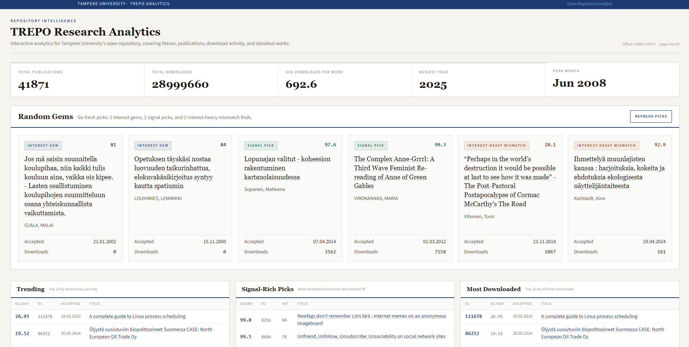

# TREPO Research Analytics



TREPO Research Analytics is a local analytics toolkit for exploring Tampere University's TREPO open repository. It scrapes recent repository submissions, enriches each publication with download and accepted-date metadata, stores the result in SQLite, and exposes the data through both command-line reports and an interactive Flask dashboard.

The project is built for answering questions such as:

- Which TREPO works have attracted the most downloads?
- Which publications are trending fastest relative to their accepted date?
- Which years and work types dominate the repository?
- Which titles look unusually interesting, and do those titles also attract downloads?
- What hidden or overlooked works are worth browsing next?

## What It Does

The scraper starts from TREPO's recent submissions listing at:

```text
https://trepo.tuni.fi/handle/10024/105882/recent-submissions
```

For each publication it finds, it stores the title, author, year, work type, TREPO handle URL, source listing offset, and timestamps in a local SQLite database. It then visits the publication page to extract the accepted date and calls TREPO's JSON statistics endpoint to collect download counts:

```text
https://trepo.tuni.fi/simplestats/rest?handle=10024/234747
```

Runs are resumable. The scraper stores its latest listing offset and upserts publication rows by handle URL, so stopping and restarting a run is safe. A separate incremental workflow can scan only newly appeared submissions from the front page and stop once it reaches a page of already-known works.

## Key Features

- Resumable TREPO scraping with configurable offset, page size, request delay, timeout, and page limit.
- Download enrichment through TREPO's `simplestats` JSON endpoint.
- Accepted-date enrichment from each publication's handle page.
- SQLite storage with a simple schema for works and scraper progress.
- Console reports for top downloads, top authors, publications by year, downloads by year, downloads by type, and work type counts.
- JSON export of the current database state.
- Optional OpenAI-powered "interestingness" ratings for publication titles.
- Signal-style analytics combining download performance and title interestingness.
- Flask dashboard with summary metrics, charts, rankings, random discovery picks, and searchable/filterable works.
- Docker and Docker Compose support for running the dashboard behind a local reverse proxy.

## Dashboard

The web dashboard turns the local SQLite database into an exploratory interface. It includes:

- Top-level metrics for total publications, total downloads, average downloads per work, busiest year, and peak accepted month.
- Random discovery cards for interesting titles, signal-rich works, and interest-heavy mismatch finds.
- Ranking tables for most downloaded, fastest trending, most interesting, signal-rich, dormant, low-interest, low-signal, and outlier works.
- Charts for publications by year, downloads by year, publication types, interest buckets, work type signal, and accepted-month activity.
- A searchable works table with filters for title, author, year, work type, downloads, interest rating, accepted-date range, sort field, direction, and result limit.
- JSON endpoints used by the dashboard:
  - `/api/works`
  - `/api/random-gems`

Start it locally with:

```powershell
trepo-scraper serve --host 127.0.0.1 --port 5000
```

Then open:

```text
http://127.0.0.1:5000
```

## Requirements

- Python 3.13 or newer
- SQLite, provided by Python's standard library
- Network access to `trepo.tuni.fi` for scraping
- Optional: Docker and Docker Compose
- Optional: an OpenAI API key for title interestingness ratings

## Setup

PowerShell:

```powershell
python -m venv .venv
.\.venv\Scripts\Activate.ps1
python -m pip install --upgrade pip
python -m pip install -r requirements.txt
python -m pip install -e .
```

After installation, the `trepo-scraper` command is available in the activated environment.

## Configuration

The CLI loads environment variables from a `.env` file in the project root. The defaults work for local development, but these variables can be used when needed:

| Variable | Purpose | Default |
| --- | --- | --- |
| `TUNI_SCRAPER_PROJECT_ROOT` | Override the detected project root. | Repository root |
| `TUNI_SCRAPER_DATA_DIR` | Directory for generated data files. | `data` |
| `TUNI_SCRAPER_DB_PATH` | SQLite database path. | `data/trepo_scraper.db` |
| `TUNI_SCRAPER_EXPORT_PATH` | Default JSON export path. | `data/publications.json` |
| `OPENAI_API_KEY` | API key used by `rate-interest` and `update-new` ratings. | Not set |
| `OPENAI_MODEL` | OpenAI model used for title ratings. | `gpt-4.1-mini` |

Example `.env`:

```dotenv
TUNI_SCRAPER_DB_PATH=data/trepo_scraper.db
OPENAI_MODEL=gpt-4.1-mini
OPENAI_API_KEY=your-api-key
```

Do not commit real API keys or private environment files.

## Usage

Scrape from the saved offset:

```powershell
trepo-scraper scrape --delay 1.0
```

Limit a test run to two listing pages:

```powershell
trepo-scraper scrape --limit-pages 2 --delay 1.0
```

Start over from the first listing page and refresh download counts:

```powershell
trepo-scraper scrape --start-offset 0 --refresh-downloads --delay 1.0
```

Fetch only newly appeared submissions from the front page, then rate those new titles:

```powershell
trepo-scraper update-new --delay 1.0 --batch-size 100
```

Print summary reports:

```powershell
trepo-scraper report
```

Print shorter or longer top lists:

```powershell
trepo-scraper report --limit 25
```

Export current data to JSON:

```powershell
trepo-scraper export-json --output data/publications.json
```

Use OpenAI to rate publication titles by how unusually interesting they sound:

```powershell
trepo-scraper rate-interest --batch-size 100
```

Rate only a subset while testing the prompt:

```powershell
trepo-scraper rate-interest --limit 200 --batch-size 50
```

Re-rate titles that already have an interestingness value:

```powershell
trepo-scraper rate-interest --rerate --batch-size 100
```

Reset scraper progress back to the beginning:

```powershell
trepo-scraper reset-progress --offset 0
```

Run the dashboard:

```powershell
trepo-scraper serve --host 127.0.0.1 --port 5000
```

Use a custom database path with any command:

```powershell
trepo-scraper --db-path data/another_trepo.db report
```

## Command Reference

| Command | Purpose |
| --- | --- |
| `scrape` | Scrape recent submissions and enrich works with accepted dates and download counts. |
| `update-new` | Scan from the front page for new works, stop when known works are reached, and rate only the new titles. |
| `report` | Print text reports from the SQLite database. |
| `export-json` | Export overview data and all works to JSON. |
| `rate-interest` | Use OpenAI structured output to score stored publication titles from 0 to 100. |
| `reset-progress` | Set the saved scraping offset manually. |
| `serve` | Run the Flask dashboard. |

Useful `scrape` options:

| Option | Purpose |
| --- | --- |
| `--start-offset` | Override the saved starting offset for this run. |
| `--max-offset` | Set the maximum TREPO recent-submissions offset. |
| `--page-size` | Set the listing page size used for offset progression. |
| `--delay` | Wait between requests. Keep this polite for TREPO. |
| `--timeout` | HTTP timeout in seconds. |
| `--limit-pages` | Stop after a fixed number of listing pages. Useful for tests. |
| `--refresh-downloads` | Re-fetch details and download counts even for already-scraped works. |

## Stored Data

By default, the SQLite database lives at:

```text
data/trepo_scraper.db
```

The `works` table stores:

- TREPO handle URL
- title
- author
- publication year
- work type
- optional OpenAI interestingness rating
- download count
- accepted date
- listing offset and listing URL
- first-seen, last-seen, and detail-scraped timestamps

The `progress` table stores:

- scraper progress key
- next listing offset
- maximum offset
- page size
- last progress update timestamp

## Interest Ratings And Signal Scores

The optional rating workflow uses OpenAI to score titles from `0` to `100` based only on how unusually interesting, distinctive, or curiosity-inducing each title sounds. It does not judge academic quality, correctness, importance, or the underlying publication.

Those ratings unlock several dashboard views:

- "Most Interesting" ranks titles by rating.
- "Signal-Rich Picks" combines download rank and interest rank.
- "Download-Heavy Outliers" highlights highly downloaded works with comparatively ordinary titles.
- "Interest-Heavy Outliers" highlights unusually interesting titles with lower download performance.
- "Random Gems" helps surface works that might otherwise be buried in the repository.

The rating command requires `OPENAI_API_KEY`.

## Docker

Start the dashboard with Docker Compose:

```powershell
docker compose up --build -d
```

Stop it again:

```powershell
docker compose down
```

The Compose setup builds the local Dockerfile, starts a single container named `trepo-analytics`, and publishes it only on `127.0.0.1:5000` so a host reverse proxy can expose it deliberately. The image includes the current `data/trepo_scraper.db` file at build time and serves the Flask app with Gunicorn at:

```text
http://127.0.0.1:5000
```

To point the container at another SQLite file, pass:

```powershell
docker run -e TUNI_SCRAPER_DB_PATH=/app/data/your.db trepo-analytics
```

## Project Layout

```text
src/tuni_scraper/
  cli.py          Command-line interface
  config.py       Defaults, paths, and environment handling
  scraper.py      TREPO HTTP scraping and enrichment workflow
  parsing.py      HTML and JSON parsing helpers
  database.py     SQLite schema, queries, and export logic
  llm_rating.py   OpenAI title-rating workflow
  reports.py      Plain-text table rendering
  web.py          Flask app and JSON endpoints
  templates/      Dashboard HTML template

tests/
  test_database.py
  test_parsing.py
  test_scraper.py

data/
  trepo_scraper.db
```

## Development

Install development dependencies:

```powershell
python -m pip install -e ".[dev]"
```

Run the test suite:

```powershell
pytest
```

The tests cover parsing behavior, database behavior, and scraper control flow. For scraping changes, prefer small `--limit-pages` runs before a full refresh.

## Notes

- Keep request delays reasonable when scraping TREPO.
- The bundled SQLite database is local project data, not a remote service.
- Download counts come from TREPO's statistics endpoint and reflect what that endpoint returns at scrape time.
- OpenAI title ratings are subjective helper signals for exploration, not academic assessments.
